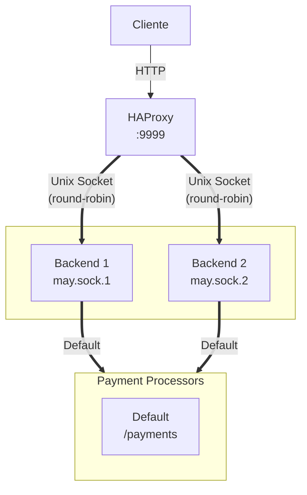

# 🦀 Rust + monoio runtime (bytedance)
Submission for [rinha-de-backend-2025](https://github.com/zanfranceschi/rinha-de-backend-2025)

## Stack

- **Rust** com monoio
- **HAProxy** para load balancing
- **Unix Sockets** para comunicação entre o load balancer e backends
- **MiMalloc** como alocador

## Escolhas Técnicas

### Por que monoio?
Testar o mononoi vs tokio-uring.

### Por que Unix Sockets?
Baseado na submissão do Alan Silva.

### Por que tanto Unsafe?
Queria testar quais seriam os ganhos ao abandonar as checagens de segurança do rust.

## Arquitetura

## Otimizações

- **monoio**: I/O assíncrono de alta performance com io_uring
- **Buffers pré-alocados**: Quase zero alocações no hot path
- **Parsing manual**: Reduz overhead do serde_json
- **Lock-free hashmaps**: DashMap para estatísticas
- **MPMC channels**: Desacopla I/O de processamento

## ⚠️ Atenção

Este código prioriza performance sobre tudo e não deve ser utilizado como referência pois:
- Uso extensivo de `unsafe`
- Sem tratamento erros
- Otimizado para o caso específico da Rinha
